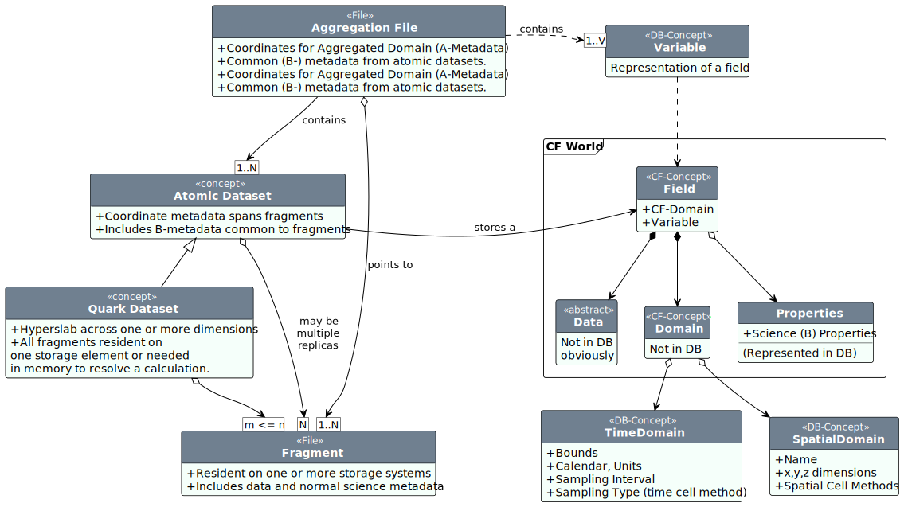

# Atomic Datasets

A key concept for CFstore is that of an _Atomic Dataset_. An atomic dataset is one variable from one simulation with a common temporal cell method and sampling interval. (We could treat an
atomic dataset as one variable from one ensemble, but for practical reasons we don't.)

Atomic datasets are presented to the user workflow via _Aggregation Files_ which point to a bunch of atomic datasets distributed across a bunch of file _Fragments_.

An atomic datset may be present in several different locations (or not yet even generated, though we know it's coming, as for example might happen when we expect a 150 year simulation, but we have only 50 years simulated so far). 

We talk about these partial atomic datasets as quark datasets. The most likely way we encounter those is via incomplete atomic datasets, or as part of an atomic dataset which has been migrated to disk. 

These notions are important, because they give us the language to think about our workflow in detail, and to manage the necessary information in a database, in our case "CFStore".

CFStore represents all of these concepts using pieces that can be re-used between atomic-datasets, which is what the "aggregation" (hollow diamonds) rather than "composition" (filled diamonds) notation means in the figure above.

It is very important to use aggregation in conjunction with CFStore, to avoid both bloating in the database, and and overwhelming amount of information for the user (who doesn't need to know whether there are 10 or 100 files in an atomic dataset - ever)!

This means that if you have lots of files,  you really must aggregate your data using CFA _before_ uploading, otherwise each variable in each file will be treated as an atomic dataset!

Once you have atomic datasets, we need them to be unique, so we can handle quarks (subsets, and/or replicants, in different locations) properly.

The Variable model class is the key one for instantiating all the important logic, but it is the Variable interface
that is used in the middleware logic.

::: cfs.models.Variable

::: cfs.db.interface.VariableInterface