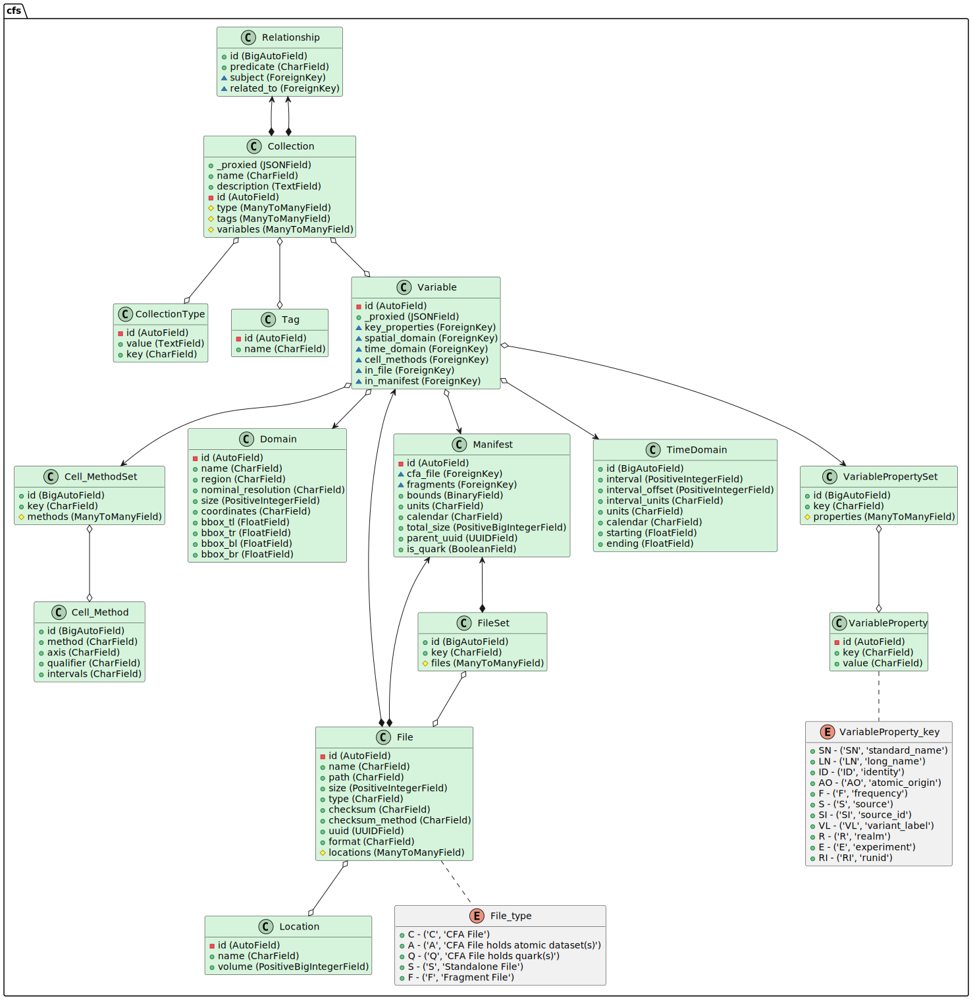

# Internal Logic

The basic concept is that _atomic_datasets_ are loaded into the database. Each atomic dataset can be described by a CFA file or a single netcdf file. These file are parsed
at input, and each individual field found in the file is stored in the database as a _Variable_.

## Class Structure

The necessary internal logic of this database is depicted in the following diagram. 

The core of the database is implemented in Django. The diagram above shows a "nearly" UML view of that structure. The key difference from proper UML is that:

- We have shown Django many to many relationships as aggregation at both ends of the relationships (i.e open diamonds);
- Where foreign key relationships have Django models.CASCADE then the we have shown the relationship as composition (i.e closed diagrams), from the _target_ of the foreign key back to the originator, otherwise we have shown them as aggregation from the originator to the target. (However, in both cases we have extra logic so that in most cases, when the last originator which points to a target is deleted, the target will also be deleted.)

(It is possible that this diagram is out of date with respect to the actual internal model. If you think that is the case, then you can regenerate it with: the `generate_puml.py` routine found in the `uml` directory. That should result in an updated version of this diagram.)

### Files and FileTypes

### Variable

The most important class is the Variable. When a file i

#### Spatial Domain

#### Temporal Domain

#### Cell Methods

### Collection

#### Relationship

#### Tag